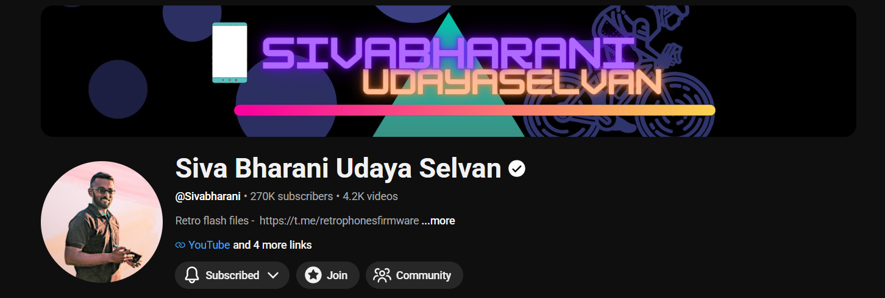
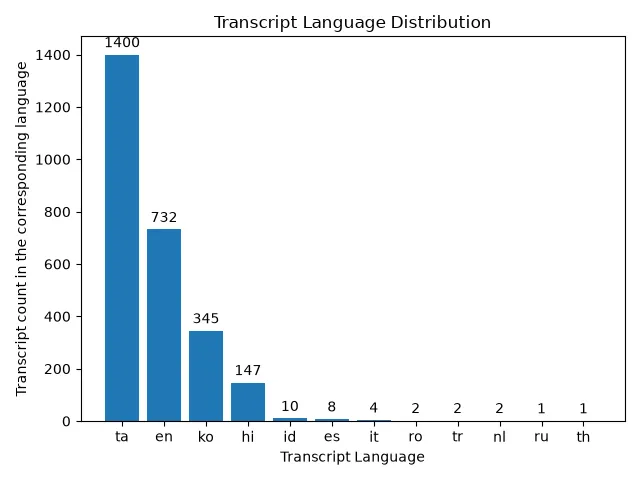

### SBUS comments
SBUS is a tamil tech enthusiast youtuber. He read and reply comments(mostly asking guidance or a detailed review of the product they have been using) of his subscribers and members of the channel in videos but as there are almost more than 2000+ videos uploaded in the channel, and would increase day by day. It became impossible to find when and where SBUS has replied to the comment/query/guidance asked by the user. This project aims to solve this problem. Channel Link - [link](https://www.youtube.com/@Sivabharani)
- scraped transcripts are from the videos on or before `June 14 2026`

- There are auto generated transcript for each video, so i will scrape all the available transcripts 
- and do processing to segregrate timestraps of each video where he says a person name. 
- user can simply search their name and it will list all the youtube video with the exact timestamp of the name being read, which would most likely be while reading that user's comment.

## Transcription Language Distribution
As all the transcript of these video are autogenerated, there is not a uniform distribution of the generated transcript language. the below bar chart demonstrates it.

## Findings
- The english transcripts are just worthless. you can see it only recognizing 2-3 words in a whole sentences, missing every details. i found this by inspecting few video having english transcripts. 
- When i tried to convert the auto generated ko (Korean) transcript to ta (Tamil) transcript, i got `The requested language is not translatable` from the youtube transcript api. i think this is because korean transcript is already auto generated, and not manually created. so i think trying to translate this transcript is the issue. i am not sure tho.